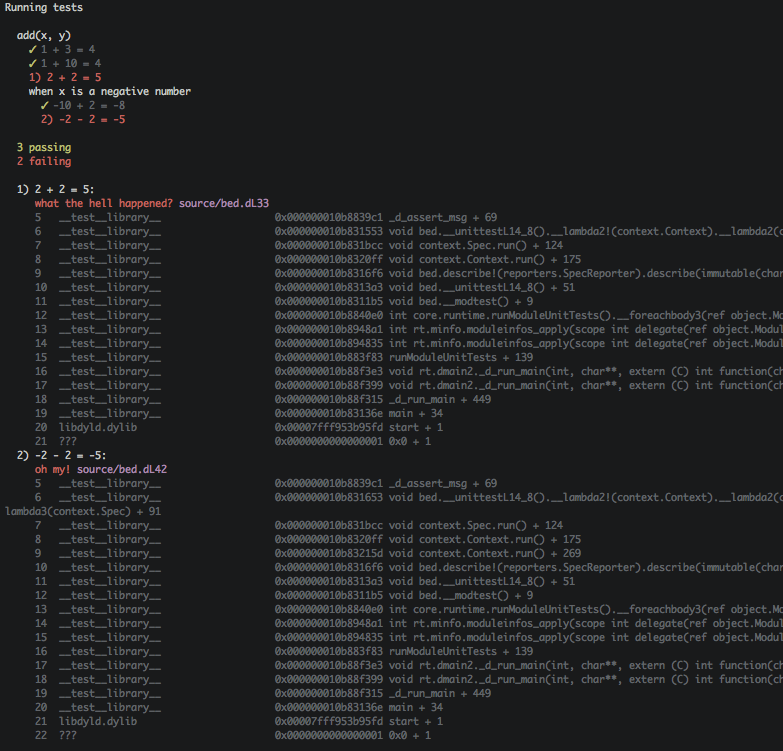

bed
===
[](https://travis-ci.org/yamadapc/bed)
- - -

**bed** is a BDD testing framework for D heavily inspired by TJ Holowaychuk's
Mocha (Node.js). It's still a WIP.

## Current API

**(heavily subject to changes - I'm looking at the dangling `t` param)**

```d
import bed;

int add(int x, int y)
{
  return x + y;
}

unittest
{

describe("add(x, y)", (t) { t
  .it("1 + 3 = 3", (t) {
    assert(add(1, 3) == 4);
  })

  .it("1 + 10 = 4", (t) {
    assert(add(1, 10) == 11);
  })

  .it("2 + 2 = 5 (meant to fail)", (t) {
    assert(add(2, 2) == 5, "what the hell happened?");
  })

  .describe("when x is a negative number", (t) { t
    .it("-10 + 2 = -8", (t) {
      assert(add(-10, 2) == -8);
    })

    .it("-2 - 2 = -5", (t) {
      assert(add(-2, -2) == -5, "oh my!");
    });
  });
});

}
```

## Where I am at (approximately) with the output (reporter system):



## LICENSE

This code is licensed under the MIT License. See [LICENSE](LICENSE) for more
information.
